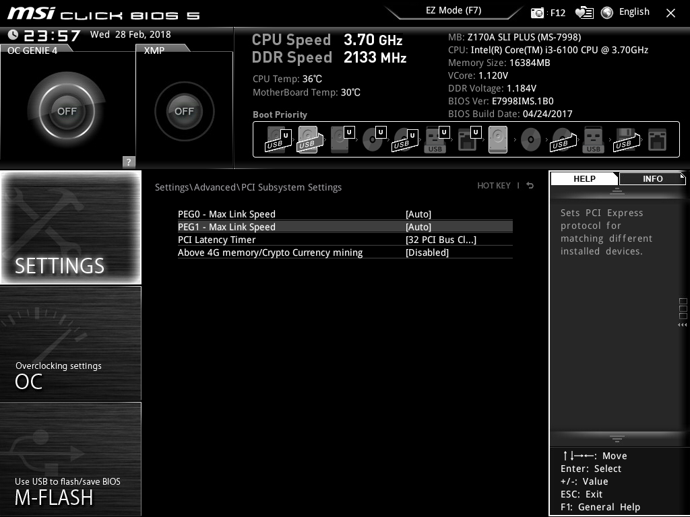
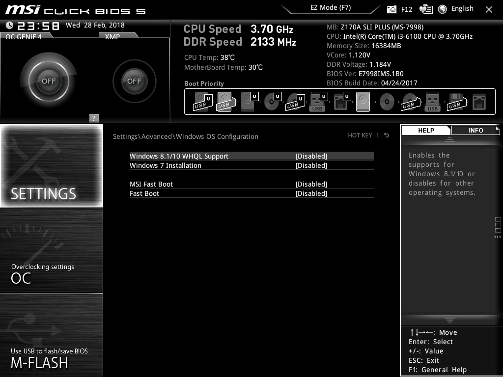
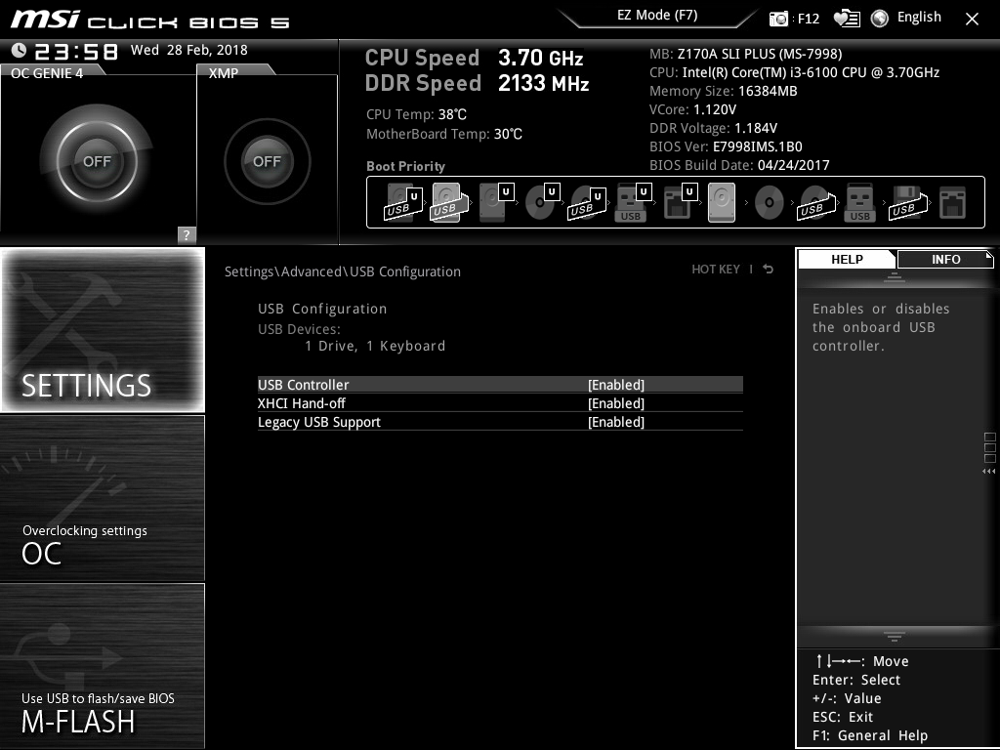
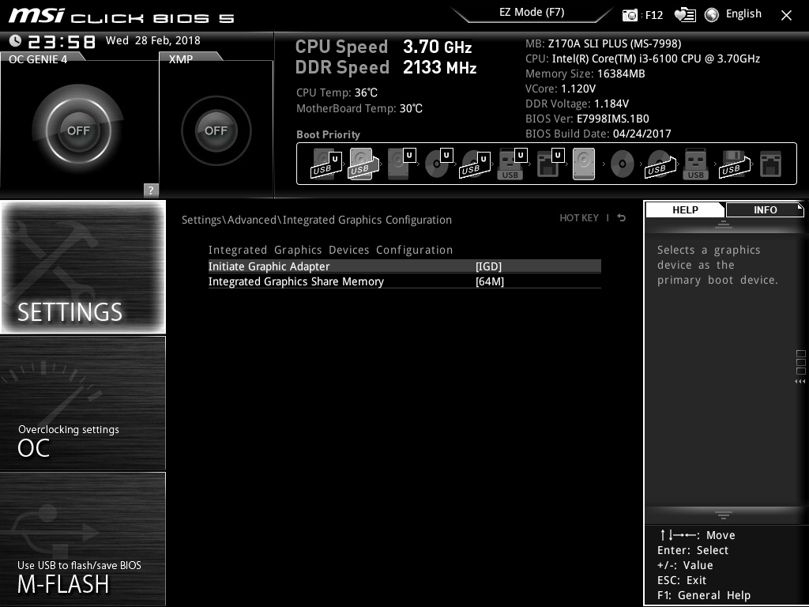

# Crypto Mining Server Setup

This is a guide on how to build and setup an Ethereum mining rig using Nvidia GTX 10 series GPUs using the Claymore Dual miner. You can easily mine other cryptos that the Claymore miner supports as well as install other miners to mine other coins.

## Compatibility

Tested on Ubuntu 16.04 Server LTS amd64 Xenial Xerus. Setup with [ubuntu-unattended](https://github.com/ki1cx/ubuntu-unattended)

## Requirements

* Clean Ubuntu server install

## Hardware List

Here is the list of hardware that I've use to build the rig. 

* **Motherboard** - MSI Pro Series Intel Z270 DDR4 HDMI USB 3 SLI ATX Motherboard [Z270 SLI PLUS](https://www.amazon.com/MSI-Z270-SLI-Motherboard-PLUS/dp/B01MR32I8L/)

* **CPU** - Intel CPU [BX80662G3900](https://www.amazon.com/gp/product/B01B2PJRPA) Celeron G3900 2.80Ghz 2M LGA1151 2C/2T Skylake

* **Memory** - CORSAIR Vengeance LPX 8GB (2x4GB) DDR4 DRAM 3000MHz C15 Memory Kit - Black [CMK8GX4M2B3000C15](https://www.amazon.com/gp/product/B0123ZBPDA/) (only need a single 4GB)

* **Power Supply** (PSU) - Corsair RMx Series, 850W, Fully Modular Power Supply, 80+ Gold Certified [RM850x](https://www.amazon.com/dp/B015YEI8JG)

* **SSD** - Transcend 64 GB SATA III MTS600 60 mm M.2 SSD [TS64GMTS600](https://www.amazon.com/gp/product/B00KLTPVJ0)

* **PCIe Risers** - [MintCell](https://www.amazon.com/gp/product/B06ZY2R85P) 6-Pack PCIe 6-Pin 16x to 1x Powered Riser Adapter Card w/ 60cm USB 3.0 Extension Cable & 6-Pin PCI-E to SATA Power Cable 

* **GPU** - Nvidia GTX 10 series GPUs

## Optional

* **USB Wifi Dongle** - [OURLINK](https://www.amazon.com/gp/product/B018TX8IDA) 600Mbps mini 802.11ac Dual Band 2.4G/5G Wireless Network Adapter USB Wi-Fi Dongle

	This is required if your rig will be connecting to the internet wirelessly. You'll still need to connect the server using LAN in order to setup the system initially.

* **PCIe Riser Adapter Board** - 4 in 1 PCI-E Riser [Adapter](https://www.amazon.com/RingBuu-Adapter-USB3-0-Rabbet-Ethereum/dp/B0756ZWGZX) Board USB3.0 PCI-E

	This is only required if your motherboard does not support as many PCIe slots as the number of GPUs you'll want to mine with. The MSI Z270 SLI Plus motherboard only comes with 6 PCIe slots. So you'll need the riser adapter board to increases the number of PCIe slots available to connect your GPUs to using the risers.
	
* **Dual PSU Power Supply Adapter** - 24-Pin ATX Motherboard Adapter Cable
	
* **Surge Protector Power Strip** - AmazonBasics 6-Outlet Surge Protector [Power Strip](https://www.amazon.com/gp/product/B00TP1C51M), 790 Joule

* **Extension Cord** 25-Feet 3 Outlet [Extension Cord](https://www.amazon.com/gp/product/B075NPFTDJ), Kasonic UL Listed, 16 / 3 SJTW 3-Wire Grounded, 13 Amp 125 V 1625 Watts, Multi-Outlet Indoor/Outdoor

## On PSU

Choose a Power Supply Unit that delivers stable electricity at high efficiency. Corsiar has a efficiency [rating system](http://www.corsair.com/en-us/blog/2012/august/80-plus-platinum-what-does-it-mean-and-what-is-the-benefit-to-me). You'll need to calculate how much power your PSU is actually able to deliver by looking at the chart.


||20% load|50% load|100% load|
|---|---|---|---|
|80 PLUS|80%|80%|80%|
|80 PLUS Bronze|	82%|85%|82%|
|80 PLUS Silver|	85%|88%|85%|
|80 PLUS Gold|87%|90%|87%|
|80 PLUS Platinum|90%|92%|89%|

For example, if you have Corsair 850W 80+ Gold Certified and you are consuming 425W of power, then you fall under 50% load column, which delivers power at 90% efficiency. This means there is a loss of 10% (425W x 0.10 = 42.5W). To deliver 425W of power, it requires bandwidth of 425 + 42.5 = 467.5W.

The base system will consume about 100 ~ 200 watts. Your GPUs will consume between 75 ~ 100 watts each if you follow my instructions.
	
| | Power Consumption (watts/hr) |
|---|---|
| Base | 100 ~ 200 | 
| GPU | 75 ~ 100 | 


#### Examples

* System A - 8 GTX 1060	GPU rig - 800 watts/hr
* System B - 8 GTX 1070 GPU rig - 1,000 watts/hr
* System C - 10 GTX 1070 GPU rig - 1,200 watts/hr

|System|Consumption (Watts)|PSU|Total Capacity (Watts)|Load|Efficiency|Loss|Loss in Watts|Total Capacity Needed|Viable|
|---|---|---|---|---|---|---|---|---|---|
|A|800|Corsair RMx 850W 80+ Gold Certified|850|100%|87%|13%|104|904||
|A|800|Corsair RMx 1000W 80+ Gold Certified|1000|80%|87%|13%|104|904|✓|
|B|1000|Corsair RMx 1000W 80+ Gold Certified|1000|100%|87%|13%|130|1130||
|C|1200|Corsair RMx 1000W 80+ Gold Certified|1000|100%|87%|13%|156|1356||

To build a rig to support as many GPUs as possible, you'll either need to purchase PSU with high capacity, which gets very expensive. Another option is to use multiple PSUs for a single motherboard setup.

⚠️ Do keep in mind, that you'll probably want to pad the **Total Capacity Needed**, since operating any system under 100% load will cause unexpected behavior and shorten the longevity. Rigs have caught on fire due to overloading of PSUs and cables.

## On Dual PSU

Using multiple PSUs is actually cheaper than buying a single PSU of large capacity. This is where the **Dual PSU Power Supply Adapter** comes into play. 


|System|Consumption (Watts)|PSU|Price|Total Capacity (Watts)|Load|Efficiency|Loss|Loss in Watts|Total Capacity needed|Viable|
|---|---|---|---|---|---|---|---|---|---|---|
|B|1000|2 x Corsair RMx 750 80+ Gold Certified|2 x $110|1500|66%|87%|13%|130|1130|✓|
|C|1200|2 x Corsair RMx 750 80+ Gold Certified|2 x $110|1500|80%|87%|13%|156|1356|✓|
|C|1200|1 x Corsair AXi 1500 80+ [Titanium](http://www.corsair.com/en-us/company/press-release/corsair-ax1500i-the-worlds-first-1500-watt-80-plus-titanium-psu-now-available) Certified|1 x $450|1500|80%|94%|6%|72|1272|✓|

The price difference between using a single GPU vs dual GPU is $450 - $220 = $230.

## On Surge Protector

Always use a power surge protector that is capable of delivery enough power from the wall to the PSU. Also make sure it has enough **Joules**, which indicates the amount of "hits" it can take. More the better. If you live in an area where electricity is not delivered stably from the energy provider, then you'll want a professional surge protector.

The AmazonBasics 6-Outlet Surge Protector Power Strip can deliver 1875W and 790 Joules worth of protection.

## On Extension Power Cables

Cables come with various ratings. The cabled mentioned in the optional section have specifications such as:

* 14 AWG
* 16 / 3 SJTW

Reference the following links carefully to determine if they meet your use case.

* http://uswireandcable.com/glossary.html
* https://en.wikipedia.org/wiki/Extension_cord

## On System Setup

1. Setup your base system (Motherboard, CPU, Memory, PSU, SSD) first.

2. Install Ubuntu Server. You can use the unattended setup detailed [here](https://github.com/ki1cx/ubuntu-unattended).

	Before installing Ubuntu, make sure your BIOS settings are as follows.
	
	* PEG0 - Max Link Speed - [Auto]
	* PEG1 - Max Link Speed - [Auto]
	* Above 4G memory/Crypto Currency mining - [Disabled]
	
		
	
	* Initial Graphics Adapter - [PEG]
	
		
		
	* Restore after AC Power Loss - [Power On]
	
		
		
	* Disable all the settings on this screen
	
		

	* Enable all the settings on this screen
	
		
	
3. Git clone this repo

	* Edit install.sh and customize the following variables
	
		```bash
		powerDrawTarget=75
		temperatureTarget=58
		memoryTransferRateTarget=1300
		numberOfGPUs=8
		minimumHashRate=22
		startingFanSpeed=50
		```
	
	* Run install.sh
	
		This installs all the packages necessary to run the miner, including Nvidia drivers and cronjobs to automatically monitor the GPUs to maintain the proper powerdraw, temperature and hashrate.
		
		```
		sudo ./install.sh
		```
4. Turn system off completely, and install GPUS to the motherboard.

5. Go into BIOS and 

	* PEG0 - Max Link Speed - [Gen2]
	* PEG1 - Max Link Speed - [Gen2]
	* Above 4G memory/Crypto Currency mining - [Enabled]
	
		
		
	* Initial Graphics Adapter - [IGD]
	
		

6. Turn system back on

	Run the following command to check that your GPUs are recognized by the system. This is enough to get the miner to work with the GPUs.

	```bash
	nvidia-smi
	```
	
	Run the following to register the GPUs and restart the system
	```bash
	nvidia-xconfig --enable-all-gpus -a --allow-empty-initial-configuration --cool-bits=28
	```
	
	Run the following command to check if X server can recognize the GPUs. This is required for overclocking.
	
	```bash
	XAUTHORITY=$(ps aux | grep [a]uth | awk '{print $17}')
	export XAUTHORITY
	export DISPLAY=:0
	
	#should turn off the GPU Logo
	nvidia-settings -c :0 -a GPULogoBrightness=0
	```

7. Plugin the USB Wifi Adapter to the motherboard

	USB Wifi Adapter is the last to be installed, because if installed first, the motherboard cannot detect the GPUs properly.

	* Install USB Wifi driver and enable
		
		If you are using the Wifi adapater mentioned below. This installs the rtl8812AU driver.
	
		```
		sudo ./setup_usb_wireless.sh
		```


## On GPU selection

When choosing GPUs to build with, here are the things to consider.

### Brand - Nvidia vs AMD

I chose to use Nvidia as opposed to AMD. From my research, Nvidia is much easier to overclock when using Linux. Although AMD has been the king for mining for sometime, Nvidia has a much more power efficient architecture, and it will save you on energy cost over time.

### GPU's Cooling method - blow style (fully enclosed case) vs open air (open case)

| Cooling | Example | Pros | Cons |
|---|---|---|---|
|  Open-Air  |   [^1] | quiet, greater supply | dust accumulation, distributor markup |
| Closed / Blower  |    [^2]  | solid construction, directed air flow, fixed price when purchased from manufacturer | noisy |
| Closed / Water-Cooled  |    [^3]  | solid construction, directed air flow, silent | expensive |
	
I have tried the first two mentioned in the above table. If you are going to have a single rig of ~ 6 GPUS running in your bedroom, then the open air design will keep the noise down, because the fan does not have to run as fast compared to the closed air (blower) design. 
	

	
If you are planning on a larger operation with ~ 100s of GPUs... then you'll probably want the blower style GPUs so you can carefuly direct the heat away from the heat sensitive components. 
	


### GPU Memory

Mining Ethereum requires DAG file to be uploaded to the GPU memory. Currently the DAG files is approaching 3GB, so purchasing a GPU with 6-8GB of memory will future proof your rig.

### Where to buy

Best place to buy Nvidia GPUs is to go to the [source](https://www.nvidia.com/en-us/geforce/products/10series/geforce-store/), since there are no additional markups. However, you'll likely need to wait until supply meets demand. If you want to get your hands on them sooner than later and don't mind the premium, then Amazon would be your best bet.

## On GPU Overclocking

### Controlling Memory speed

When mining Ethereum, you have to overclock the memeory speed to get performance boost. Modifying the memory transfer rate is easy the following. 

```bash
nvidia-settings -c :0 -a GPUMemoryTransferRateOffset[3]=<offset value to test>
```

Here is what I found to work in giving me a boost while remaining stable. I have not had a chance to try an 1080 Ti yet. 1080 (yes without the Ti) is widely known to be not good for mining due to it's GDDR5X memory.

| GPU | GPUMemoryTransferRateOffset |
|---|---|
| 1060 | 1300 | 
| 1070 | 1400 | 

### Controlling Power Draw

Giving the GPU enough power is a crucial step in stablizing the GPU

```bash
//set persistence mode on
nvidia-smi -pm 1

//set upper power limit in watts
nvidia-smi -pl 75
```

The following chart shows the power limit I've used to stablize the GPUMemoryTransferRateOffset used above.

| GPU | Power Limit (Watts) |
|---|---|
| 1060 | 75 | 
| 1070 | 100 | 

### Ethereum Hashrates

The GTX 1070s is a clear winner when it comes to mining Ethereum.

| GPU | Default | Overclocked | Price | cost per MH/s|
|---|---|---|---|---|
| 1060 | 18 MH/s | 23 MH/s| $299 | $13 |
| 1070 | 25 MH/s | 31 MH/s| $399 | $12 |
| 1080 Ti | 32 MH/s | 36 MH/s| $699 | $19 |

### Controling the fan speed

In order to control the fan speed, you'll need to set manual mode, which means the GPU will no longer automatically adjust the fan speed to the changing temperature. Make sure you are frequently running the custom script that adjusts the fan speed included in the repo or a custom script of your own.

```bash
//set fan speed across all GPUs
nvidia-settings -c :0 -a GPUFanControlState=1 -a GPUTargetFanSpeed=50

//set fan speed on a specific GPUs where <index> 
//should be replaced by the gpu you are targetting
nvidia-settings -c :0 -a [gpu:<index>]/GPUFanControlState=1 -a [fan:<index>]/GPUTargetFanSpeed=100
```

## On Stability

This deserves a section of it's own, since the success of your mining operation will be determined by how stable you can keep your system operating without interruption. Whenever the system hangs due to GPU crashes and has to be restarted manually, you are losing valuable mining time. The key ingredients to a stable system are:

* Stable memory clock speed (finding the right power draw level is also a major factor here) 
* Making sure the GPUs are operating within the range of 35 ~ 75°C. You can try to push towards 80°F, but it will affect the longevity of your GPU. Major factor will be the ambient temperature your rig is placed in.

Manufacturer's recommended maximum GPU temperatures are typically above 100°C. However, this figure is for a typical gamer playing 2-3 hours a day. For mining 24/7, the upper limit is much lower.

## Electricy Cost

Mining is most profitable if you are able to operate 24/7. Before building the rig, one should investigate the cost of electricity in your area and what the options are to keep the cost down. For example, PG&E has several [plans](https://www.pge.com/en_US/residential/rate-plans/how-rates-work/find-my-best-rate-plan.page): 

* [Tiered](https://www.pge.com/en_US/residential/rate-plans/rate-plan-options/tiered-base-plan/tiered-base-plan.page) Rate Plan (E-1)

	This is a rate plan where the more electricity consumed relative to the baseline, the more you pay. If you are mining, then you will 100% of the time consume more electricity than the baseline, which is determined by electricity consumption in your area. This plan should be avoided, and if this is the only plan available in your area, then mining is not a viable option for you.

* [TIME-OF-USE](https://www.pge.com/en_US/residential/rate-plans/rate-plan-options/time-of-use-base-plan/not-enrolled.page) (PEAK PRICING 3-8 P.M. WEEKDAYS) E-TOU-A, E-TOU-B

	Both of these options have fixed pricing on electricity consumed depending on time of day. This plan is viable for mining, since rate is not a function of how much electricity consumed. Assuming a 24/7 mining operation, calculate how much it would cost per day by looking at the cost table.


## On USB Wifi Adapters

Make sure you find one that is compatible with linux. Manufacturers may claim it works on Linux with the provided drivers, but I found them not trustworthy. I ended up finding a usable driver on github.

## On PCIe Risers

When choosing PCIe risers, make sure they are **VER 006C** or higher. Specifically, check if they have 4 high quality solid capacitors for voltage regulation and overcurrent protection. Also, chances are that 1 in 6 risers will be bad, so buy them in bulk to keep cost down.

## License
MIT

## References

[^1]: https://www.amazon.com/EVGA-GeForce-Support-Graphics-06G-P4-6267-KR/dp/B01LYN9KK6
[^2]: https://www.nvidia.com/en-us/geforce/products/10series/geforce-store/
[^3]: https://www.forbes.com/sites/marcochiappetta/2015/05/29/evga-steps-out-with-custom-water-cooled-geforce-gtx-titan-x-graphics-card/#17db683c6787

This is a test.
